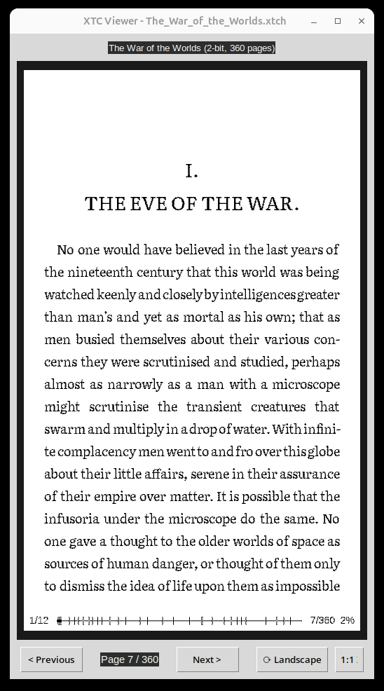

# Python XTC Viewer

Desktop viewer for XTC/XTCH e-book files used by CrossPoint Reader on the Xteink X4. Enables you to preview XTC files in an easy way.

## Usage

```bash
python bin/xtc-viewer.py <file.xtc|file.xtch>
```

## Controls

| Key/Button | Action |
|------------|--------|
| Left/Right, Space | Navigate pages |
| R | Toggle landscape/portrait |
| 1 | Toggle 1:1 X4 display size (480×800) |
| Escape | Quit |



