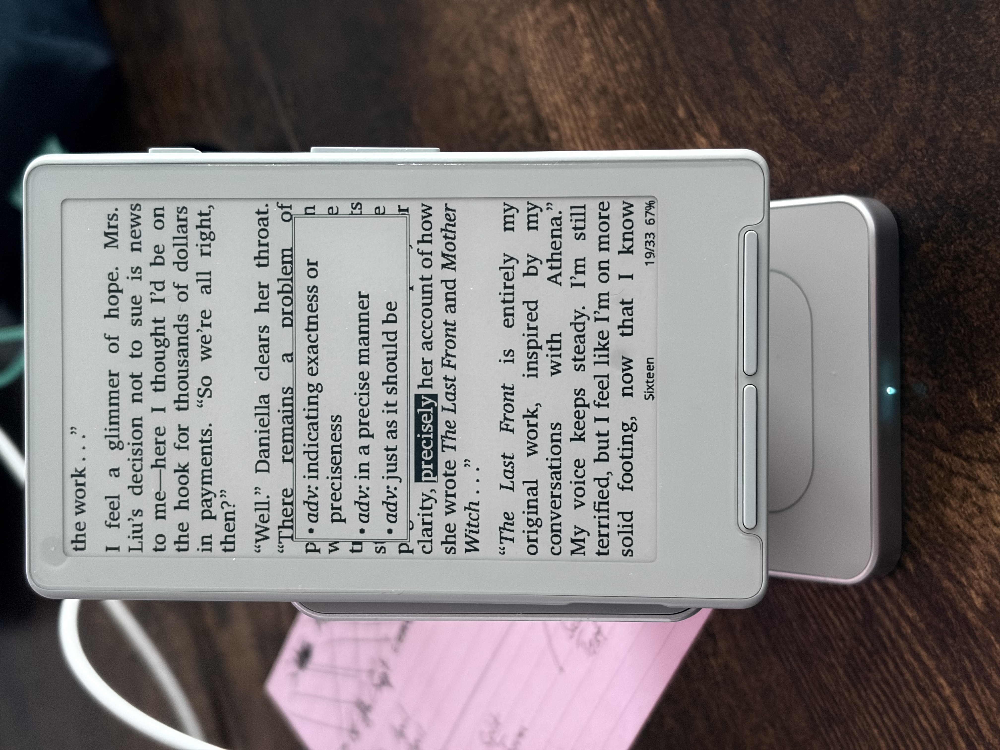

# shortbread


Custom firmware for the **Xteink X4** e-paper device. A lean, focused build — e-reader first, with games and small utilities on the side.

## Why this exists

A couple of Xteink firmware forks caught my eye — each had something the others didn't. [biscuit](https://github.com/yattsu/biscuit) had the cleanest UI and the games. [CrossInk](https://github.com/uxjulia/CrossInk) had the best reading experience. I wanted both in one place, stripped to just the parts I actually use. So I built shortbread.

Want a feature added, changed, or removed? Open an issue or ping me on GitHub.

## Hardware

| Spec | Value |
|------|-------|
| SoC | ESP32-C3 (RISC-V, 160MHz) |
| RAM | 380KB SRAM |
| Flash | 16MB |
| Display | 4.26" 800×480 e-ink, 1-bit mono |
| Input | 7 buttons |
| WiFi | 2.4GHz 802.11 b/g/n |
| BLE | 5.0 |
| Storage | MicroSD (FAT32) |
| Port | USB-C |

## What's in it

Five tiles on the home screen:

| Tile | Contents |
|------|----------|
| **Network** | WiFi connect, BLE scanner |
| **Tools** | File browser, calculator, clock, unit converter, password manager, WiFi scanner |
| **Games** | Casino, Minesweeper, Sudoku, Chess, Snake, Tetris, Maze, and more |
| **Reader** | EPUB 2/3, KOReader sync, Calibre wireless transfer, recent books with cover art |
| **Settings** | Display, reader fonts, controls, WiFi file transfer, device info |

## Installing

No releases yet — manual install only.

### Prerequisites

- [PlatformIO](https://platformio.org/) (CLI or VS Code extension)
- Python 3.8+
- USB-C data cable

### Flash

```bash
git clone --recursive https://github.com/deepakvettickal/shortbread
cd shortbread
pio run --target upload
```

### Build only

```bash
pio run -j 16
```

## SD card

Data is stored under `/shortbread/` on the MicroSD card (FAT32).

## Dictionary



shortbread ships with an offline dictionary that runs entirely on-device. Tap **Power** inside any book to enter dictionary mode and look up a word.

### Controls

| Button | In a book | In dictionary mode |
|--------|-----------|---------------------|
| **Power** | Enter dictionary mode | Exit dictionary mode |
| **Up / Down** | Page turn / scroll | Move highlight to adjacent line |
| **Left / Right** | Page turn | Move highlight word by word |
| **Confirm** | Open reader menu | Look up the highlighted word |
| **Back** | Go home | Close popup, then exit dictionary mode |

The popup sits directly under (or above) the highlighted word so the word itself stays visible. The body font + size match the book you're reading.

### One-time setup

The lookup data lives on the SD card under `/shortbread/dict/`. To build the files (uses WordNet 3.1, ~150K headwords with senses, synonyms and examples):

```bash
python3 scripts/build_dict.py --out dict_out
```

Then copy the three output files onto the SD card:

```
/shortbread/dict/pages.idx     ~10  KB  (RAM-loaded page table)
/shortbread/dict/words.idx     ~3   MB  (sorted word index)
/shortbread/dict/defs.bin      ~15  MB  (compressed definitions)
```

Total ~18 MB. After the initial copy you never touch this again.

If the files are missing, dictionary mode still works — the popup just shows a setup hint and a (mildly funny) "word not found" message when the lookup can't reach a definition.

### How it works

Lookup is a single 4 KB page read from `words.idx` (binary-searched against the in-RAM `pages.idx` table), followed by one variable-length read from `defs.bin` and a raw-DEFLATE decompress via `uzlib`. Round-trip is in the 10–20 ms range — fast enough to feel instant.

## Credits

Built on top of:

- **[crosspoint-reader](https://github.com/crosspoint-reader/crosspoint-reader)** — core EPUB engine, rendering, KOReader sync, Calibre transfer. The foundation everything runs on.
- **[biscuit](https://github.com/yattsu/biscuit)** — UI design, games, and overall architecture this fork is based on. Sorry [@yattsu](https://github.com/yattsu) — I borrowed heavily from your work and even stole the naming idea (biscuit → shortbread). Your build is what made this possible.
- **[CrossInk](https://github.com/uxjulia/CrossInk)** — reader settings menu and fonts (ChareInk, Lexend Deca).
