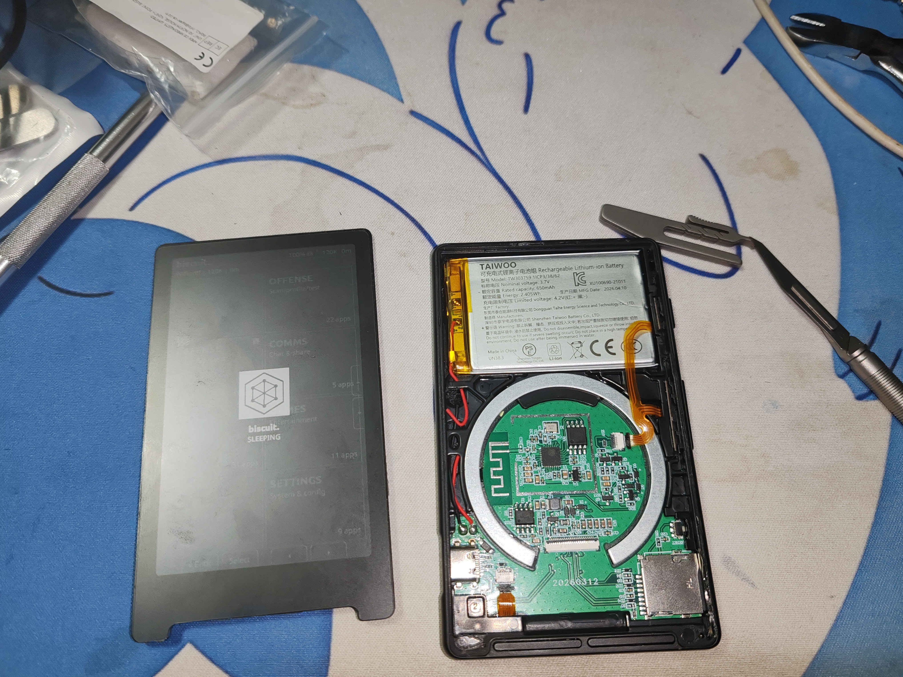
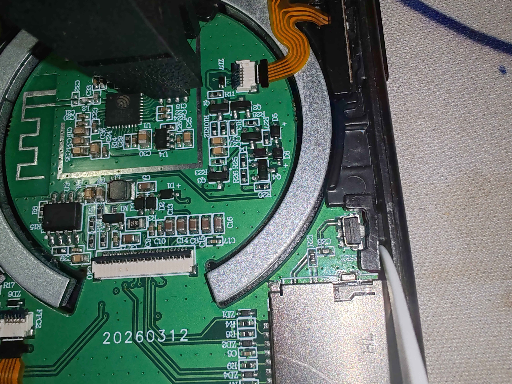
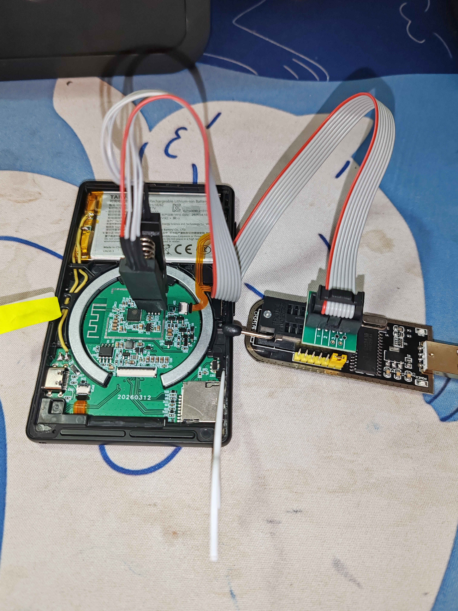

# Recover a non-working Xteink


Use this guide only if USB installation cannot work. It writes firmware directly to the reader's flash memory chip with a separate programmer.

If you can install firmware over USB, use that method instead. This repair can damage the reader.

*Example: a device stuck on Biscuit firmware, unresponsive to a normal USB flash.*


## What you need

- Acetone or nail polish remover.
- A flash programmer, such as a CH341a, Bus Pirate, Raspberry Pi, Raspberry Pi Pico, or suitable Arduino.
- Programmer software, such as flashrom with libftdi.
- `esptool.py` only if you copy firmware from another working reader.
  
## Read this first

- Do not short, cut, or puncture a lithium battery. It can catch fire.
- Do not bend the display or force its connector. The display is fragile.
- Stop if you are not confident with electronics repair. A wrong connection or short circuit can permanently damage the reader.


## Repair steps

### 1. Get a firmware image

Use one of these options:

- Use the backup from @Uri-Tauber at `crosspoint-reader/docs/images/spiflash/crosspoint_spiflash_backup.tar.xz`. Extract the `.bin` file. Do not use it on a device other than an Xteink X4 or X3.
- Copy a backup from a working, unlocked reader over USB:
    - Turn on the working reader and connect its USB cable. Then run:
    ```bash
    ~$ pio pkg exec -p tool-esptoolpy -- esptool.py --chip esp32c3 -p /dev/ttyACM0 -b 921600 read_flash 0x000000     0x1000000 crosspoint_backup.bin
     # or
    ~$ esptool.py --chip esp32c3 -p /dev/ttyACM0 -b 921600 read_flash 0x000000 0x1000000 crosspoint_backup.bin
    ```

### 2. Disconnect power and accessories

- Remove the SD card and keep it safe.
- Remove the USB cable.
- Make sure that nothing else supplies power to the board.

### 3. Remove the screen

Nail polish remover softens the glue under the screen edge. This takes time.

- Work in a well-ventilated place with no flame or ignition source. Apply acetone or nail polish remover around the screen edge.
- Keep the edge wet for about two hours.
- Start at a lower corner and slowly lift the screen edge.
- Use a non-conductive tool if needed.
- Lift the ZIF connector latch to release the screen cable.




### 4. Disconnect the battery

Cut one battery wire close to the board. Cover the cut end with tape so it cannot short circuit.


### 5. Hold Reset

Keep **Reset** pressed while you read or write the chip. A small piece of pointed plastic can hold it.


### 6. Attach the test clip

Connect the test clip to the flash chip before you connect the programmer to USB:

- Align the clip red wire with pin 1. A dot marks pin 1 on the chip and board.
- Make sure that every clip lead touches a chip pin.
- If the programmer has a voltage setting, select 3.3V.
- Make sure that no other power source is connected. Use a multimeter if you are unsure.
  



### 7. Connect the programmer to the computer



### 8. Read the chip twice

Read the chip twice and compare the hash values. If they differ, fix the clip connection before you write anything to the chip.

```bash
~$ sudo flashrom --programmer ch341a_spi -r backup_0.bin
    [...]
    Reading flash... done.
~$ sudo flashrom --programmer ch341a_spi -r backup_1.bin
    [...]
    Reading flash... done.
    # lets compare the hashes from the back ups
~$ md5sum backup_0.bin
    211522e56616ea46ac9bcf82d3451eb2  backup_0.bin
~$ md5sum backup_1.bin
    211522e56616ea46ac9bcf82d3451eb2  backup_1.bin
```

### 9. Write the firmware

```bash
~$ sudo flashrom --programmer ch341a_spi -w crosspoint_backup.bin
    [...]
    Reading old flash chip contents... done.
    Erasing and writing flash chip... Erase/write done.
    Verifying flash... VERIFIED.
```

### 10. Start and test the reader

- Disconnect the programmer from USB.
- Remove the test clip.
- Release **Reset**.
- Insert the SD card.
- Reconnect the screen.
- Connect the reader to USB power. Do not reconnect the battery yet.
- Hold **Power** for a few seconds.


If CrossPoint starts, fully reassemble the reader.
