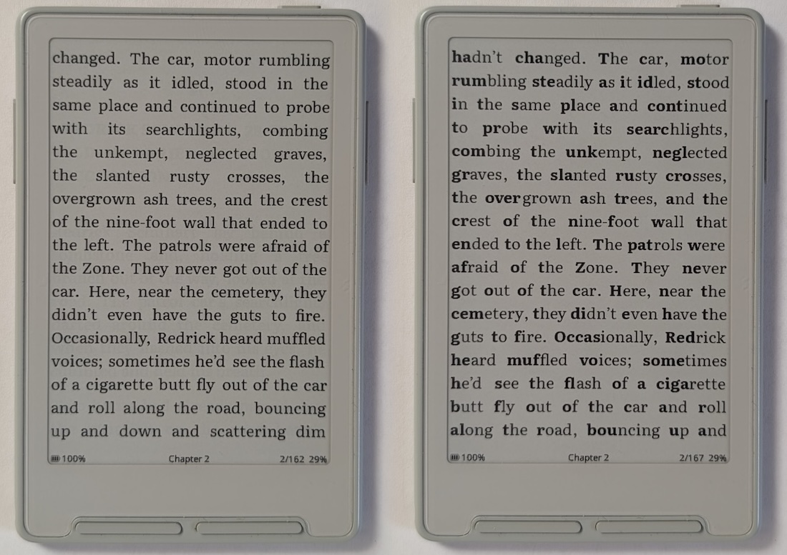

# Focus Reading

Focus Reading makes the first part of each word bold. Some readers find that it helps them follow the text. It is based on the Bionic Reading technique.

*Left: Focus Reading off. Right: Focus Reading on. Both using Literata.*

## Turn it on

1. Open **Settings → Reader**.
2. Turn on **Focus Reading**.

When you change this setting, CrossPoint prepares the open EPUB again for the new layout. Your book file does not change.

## Examples

*Focus Reading with Noto Serif font*

*Focus Reading with Merriweather font*

*Focus Reading with Atkinson Hyperlegible Next font*

## What it changes

- Focus Reading changes regular book text only. It does not change text that is already bold.
- The setting applies to every book on this reader until you turn it off.
