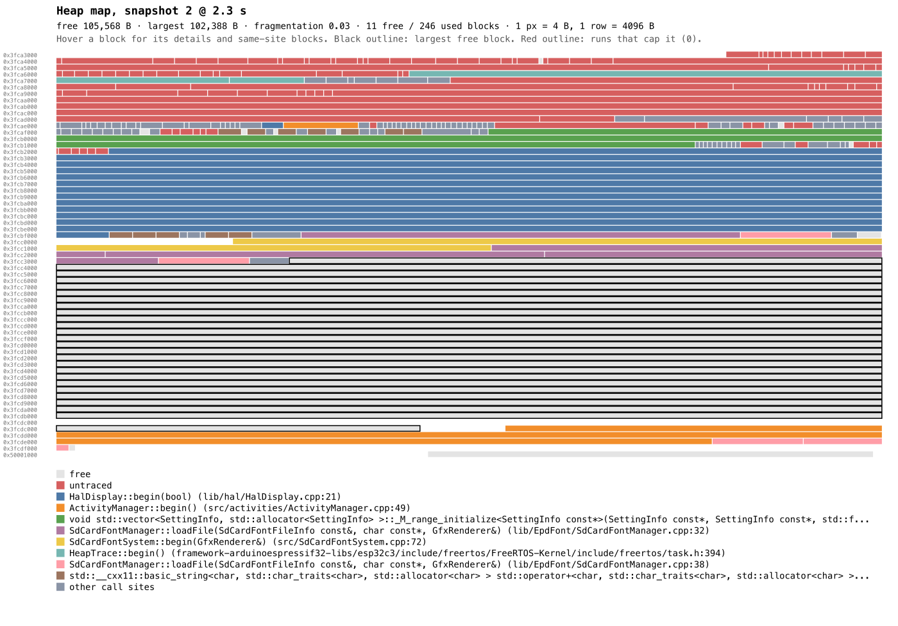
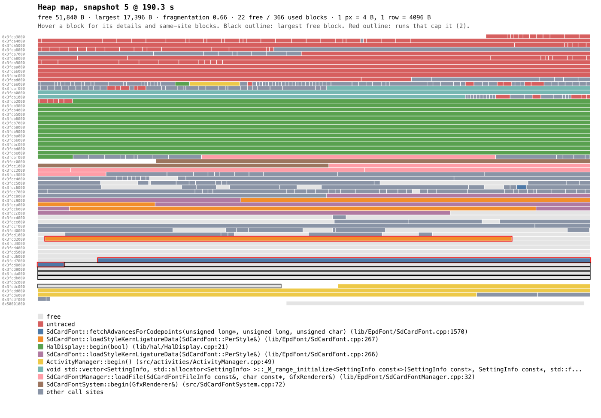

# Heap allocation tracing

The `heaptrace` build environment records every internal-heap allocation and
free on the device, with the allocating call stack, and streams them over USB
serial. `scripts/heap_trace.py` replays that stream. It answers questions the
periodic `[MEM]` line cannot:

- which call sites allocate and free the most;
- what is still allocated, and who allocated it;
- which allocations split free memory, so a large allocation fails even though
  enough memory is free in total.

## When to use it

Use it to **explain** a heap problem, such as an unexpected drop in
`MaxAlloc` or an allocation-failure fallback in the logs. Take A/B heap and
timing numbers with the `default` environment. Tracing changes what it
measures. Measured on an X3 against `default`:

| Cost | Size | Why |
|---|---|---|
| Free heap | about 24 KB lower | the IRAM, static buffers and drain task below |
| IRAM | +10 KB | frame-pointer prologues and the hooks. On the C3, IRAM and DRAM share one SRAM pool. |
| Static buffers | +10 KB `.bss` | the 8 KiB record ring, plus line, snapshot and task-list buffers |
| Drain task | 3.4 KB heap | stack and TCB |
| Flash | about +200 KB | `-fno-omit-frame-pointer` throughout ESP-IDF and the app |

The lower free heap can change heap-dependent behavior. For example, the SD-font
cache keeps data only when at least 40 KiB is free, and EPUB CSS parsing is
skipped below 64 KiB. Check the logs for such differences before comparing a
traced run with an untraced one.

The environment exists for the ESP32-C3 profiles only (X3/X4), where the heap
limit matters most because there is no PSRAM. In every other environment the
tracer compiles out completely. It does not support the ESP32-S3 boards:

- Stack capture walks RISC-V frame pointers.
  `CONFIG_ESP_SYSTEM_USE_FRAME_POINTER` is RISC-V only in ESP-IDF, so the
  Xtensa-based S3 would need a different unwinder.
- The USB-OTG profiles (`x4pro`, `x4c`, `papermono`) do not rebuild the Arduino
  core with `custom_sdkconfig`, so the heap hooks cannot be enabled there.
- Snapshots walk internal RAM only. On boards with PSRAM, the map and the
  replay corrections would not cover PSRAM allocations.

## Capture

```sh
pio run -e heaptrace -t upload
pio device monitor -e heaptrace -f log2file   # saves platformio-device-monitor-*.log
```

The first snapshot is taken as soon as the host connects. Take another at each
point you want to examine, such as after opening a book or after 10 page turns,
by pasting this line into the monitor and pressing Enter (the firmware stops
reading a command after 1 s without input, so slow typing can cut it off):

```text
CMD:HEAPTRACE SNAP
```

`CMD:HEAPTRACE` with no argument logs the recording state, dropped records and
the reasons for automatic resynchronization.

Any capture that keeps whole lines works as input: the `log2file` log, another
serial logger's output, or an `events.jsonl` from a monitor that writes one. Keep the capture together with its
`firmware.elf`, because the call sites are resolved from that ELF.

Two compile-time settings can be raised when records are dropped (the ring must
be a power of two) or when stacks are too short:

```sh
PLATFORMIO_BUILD_FLAGS="-DHEAP_TRACE_RING_BYTES=16384 -DHEAP_TRACE_STACK_DEPTH=8" pio run -e heaptrace -t upload
```

A larger ring costs the same amount of heap. The stack depth can be 1 to 16;
each extra frame adds 4 bytes to the stack of every task that allocates.

## Analyze

```sh
python3 scripts/heap_trace.py CAPTURE snapshots                      # heap state at each snapshot
python3 scripts/heap_trace.py CAPTURE pins --from-snap 3 --to-snap 20
python3 scripts/heap_trace.py CAPTURE frag --snap 5
python3 scripts/heap_trace.py CAPTURE map --snap 5 --out heap.svg
python3 scripts/heap_trace.py CAPTURE churn --from-snap 5 --to-snap 6
python3 scripts/heap_trace.py CAPTURE summary --frames 3
```

A typical fragmentation investigation:

1. **`snapshots`** lists free heap, largest free block, fragmentation
   (`1 - largest / free`), free-block counts and a size histogram for each
   snapshot. Find the snapshots where the largest block drops while free heap
   stays flat.
2. **`pins`** ranks call sites whose blocks repeatedly cap the largest free
   block across a range of snapshots. A block caps it when it sits in a short run
   of used blocks between two free blocks, and freeing that run would create a
   region larger than the current largest. `gain` is how much larger that region
   would be.
3. **`frag --snap N`** shows one snapshot in detail: the free-block histogram,
   the largest holes, and each capping run with its size, age, task and call
   site. A `*` marks runs whose release alone would beat the current largest
   block.
4. **`map --snap N`** draws the snapshot as an SVG. Each row is 4 KiB, one pixel
   is 4 bytes, and colors identify call sites (listed in the legend). The largest
   free block is outlined in black, and runs that cap it in red. Open the file in
   a browser and hover a block: its address, size, age and call site appear at
   the top, and every block from the same call site is highlighted.
5. **`churn --from-snap A --to-snap B`** counts allocations, frees, bytes and
   median lifetime per call site between two snapshots. Short-lived churn that is
   freed immediately rarely fragments the heap; long-lived blocks allocated
   during a burst of temporary allocations often do.

`summary` reports stream health, the busiest call sites overall and what is
still allocated at the end of the capture.

### Example maps

Both maps come from one X3 capture of a Korean EPUB, opened with an empty book
cache. The first is Home before opening the book: 105,568 B free, and the
largest free block is 102,388 B.



The second is 10 pages into the book, while the chapter layout is still being
built in the background. Free heap is 51,840 B, but the largest free block is
only 17,396 B.

- The blue advance-width table from `SdCardFont::fetchAdvancesForCodepoints`
  (red outline) sits between the outlined 17 KB block and the free rows above
  it. Freeing it would give a 39 KB block.
- An orange kerning table caps a second hole.



To hover the blocks, open [heap-map-home.svg](images/heap-trace/heap-map-home.svg)
or [heap-map-fragmented.svg](images/heap-trace/heap-map-fragmented.svg) from a
local checkout in a browser.

Every command accepts:

- `--elf`: the ELF of the build that produced the capture. The default is
  `.pio/build/heaptrace/firmware.elf`.
- `--frames N`: how many call frames to show per site.
- `--top N`: how many rows to print.

`frag`, `pins` and `map` also accept `--max-run`, the longest run of used blocks
counted as capping (default 3).

Call-site labels skip allocator frames, so they name the code that asked for the
memory. Skipped frames include `malloc`, `operator new`, `makeUniqueNoThrow`,
`std::make_unique`, container growth and the SDK's `psramNewArray`.

## Check a capture before trusting it

- **Stream health** (`summary`, first lines):
  - `bad`: lines that failed their checksum.
  - `seq_gaps`: lines missing from the capture.
  - `dropped_records`: records lost on the device because the ring was full.
    This happens during bursts such as a cold chapter build.
  - Any non-zero value makes per-site counts lower bounds until the next
    snapshot.
- **Reconciliation** (`snapshots`). Each snapshot walks the real heap and
  corrects the replay:
  - `verified`: traced allocations that matched a walked block.
  - `untraced`: walked blocks with no trace record. After the first snapshot this
    should stay at the number of blocks allocated before tracing started.
  - `stale`: replayed allocations that the walk showed as free. This should stay
    near zero.

Live data is exact only at snapshots. Between snapshots, lost records are
detected but cannot be recovered.

## Limits

- Stacks end at code built without frame pointers: ROM, prebuilt libraries, and
  templates instantiated inside libstdc++ such as `std::string::_M_create`. In
  those cases the recorded caller can be one frame above the real one.
- Allocations made before `HeapTrace::begin()` in `setup()` appear as
  "untraced" after the first snapshot.
- In-place `realloc` reports no free for the old block. The replay removes any
  live entry that a new allocation overlaps.
- Firmware that handles serial commands through `SerialControl` instead of the
  `CMD:` handler in `main.cpp` needs two additions:
  - pass the `HEAPTRACE` verb to `HeapTrace::handleCommand()`;
  - hold a `HeapTrace::OutputLock` while sending a screenshot, so trace lines do
    not interleave with its binary frame.

## How it works

- `CONFIG_HEAP_USE_HOOKS` makes ESP-IDF call `esp_heap_trace_alloc_hook` and
  `esp_heap_trace_free_hook` after each successful allocation or free, outside
  the heap lock (`components/heap/heap_caps_base.c`).
- The alloc hook (`src/util/HeapTrace.cpp`) walks the RISC-V frame-pointer chain
  enabled by `CONFIG_ESP_SYSTEM_USE_FRAME_POINTER`. It skips the leading IRAM
  frames, which are the hook and the allocator, and records up to
  `HEAP_TRACE_STACK_DEPTH` callers.
- Replacement `operator new` definitions keep the allocating function in the
  stack. The prebuilt libstdc++ versions have no frame pointer.
- Records go into a lock-protected ring. A drain task at the same priority as
  the loop and render tasks sends them as
  `@HT <seq> <ms> <base64> <fletcher16>` lines. Each line is written with a
  single CDC write, so log lines from other tasks cannot split it.
- A snapshot walks the heap with `heap_caps_walk` and sends every block, used or
  free, in passes of up to 96 blocks. Each pass pushes a marker into the ring
  while it holds the heap lock. The host therefore knows exactly which records
  came before the walk, and applies the walked blocks at that point.
- Snapshots are taken at the first connection, on `CMD:HEAPTRACE SNAP`, and
  automatically (at most every 2 s) after dropped records, a short serial write,
  or a serial disconnect lasting over a second.

The host-side decoder has unit tests: `python3 test/test_heap_trace.py`.
