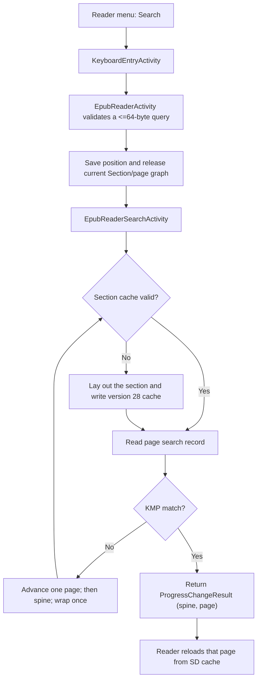

# In-Book Search Architecture

In-book search is implemented for EPUBs as a forward scan over compact text
records stored beside the rendered pages in each section cache. It deliberately
does not build a whole-book index in RAM. This design keeps the steady search
path bounded on the ESP32-C3 while preserving an exact `(spine, page)` target
for reader navigation.

## Goals and constraints

The implementation is optimized for the constraints shared by the X3 and X4:

- about 380 KB of usable RAM and no PSRAM
- one statically allocated monochrome framebuffer, sized for the larger X3
  buffer: 52,272 bytes for 792 × 528, compared with 48,000 bytes for the X4's
  800 × 480 panel
- a single-core ESP32-C3
- SD storage that is much larger than RAM, but slower and subject to write wear
- EPUB content that is laid out lazily, one spine section at a time

X3 support uses the same firmware image rather than a separate search build.
`HalGPIO` detects the device before `HalDisplay` initializes the panel, and
`GfxRenderer` then imports the runtime width, height, row width, and buffer size.
Search UI geometry comes from `UITheme` and those runtime renderer dimensions;
the keyboard and button hints already contain X3-specific spacing. Search input
uses `MappedInputManager`, so it follows the configured logical front-button
mapping on both devices.

The rendered viewport width and height are part of the section-cache validation
key. Consequently, a cache laid out for the X4 is rejected and rebuilt when the
same SD card and book are opened on an X3, and vice versa. This prevents the
search result's page number from being calculated against the other panel's
pagination.

The user-visible behavior is intentionally narrow:

- queries are limited to 64 UTF-8 bytes
- search starts at the current rendered page and moves forward
- after reaching the end of the spine, it continues through later spines
- after reaching the end of the book, it wraps once and stops at the page the
  search was initiated from
- the first matching page is returned immediately
- repeating the same query from the page returned by search starts at the next
  page, and the wrap stops before that originating page, so "find next" advances
  to a different match or reports no matches rather than re-returning it
- while searching, the status screen shows an approximate percentage of how far
  through the book the scan has reached

The result is page-granular. The reader opens the matching page and shows a
short confirmation popup; individual glyphs are not highlighted.

## Component flow



The responsibilities are split as follows:

- `EpubReaderMenuActivity` exposes the existing translated `Search` command.
- `EpubReaderActivity` owns query history and coordinates the keyboard, search
  activity, reader position, and result popup.
- `EpubReaderSearchActivity` is a small state machine that scans one page per
  main-loop iteration and distinguishes `Searching`, `NotFound`, and `Error`.
- `Page::serializeSearchText()` writes compact searchable text while the page
  already exists during layout.
- `Section::pageContainsText()` searches one record without deserializing a
  `Page` or allocating word vectors.

All SD access continues through `HalStorage` and `HalFile`; search does not
reach into SdFat directly.

Implementation entry points:

- reader orchestration: [`EpubReaderActivity.cpp`](../../src/activities/reader/EpubReaderActivity.cpp)
- cooperative scan activity: [`EpubReaderSearchActivity.cpp`](../../src/activities/reader/EpubReaderSearchActivity.cpp)
- cache creation and streaming matcher: [`Section.cpp`](../../lib/Epub/Epub/Section.cpp)
- per-page text serialization: [`Page.cpp`](../../lib/Epub/Epub/Page.cpp)

## Section cache format

Search extends `sections/<spine>.bin` to version 28. Each serialized page is
immediately followed by one search record:

```text
Page
u32 searchTextLength
u8  searchText[searchTextLength]
```

The page LUT now stores two offsets per page:

```text
u32 pageOffset
u32 searchTextOffset
```

`pageOffset` preserves normal rendering behavior. `searchTextOffset` lets the
matcher seek directly to the bounded text record without decoding page
elements, images, footnotes, styles, or word-position vectors.

The text record contains the rendered page's words in page-element order,
joined by single ASCII spaces. Images and styling metadata are excluded. The
SD cost is therefore approximately one additional copy of rendered UTF-8 text,
plus 8 bytes per page: a 4-byte text length and a 4-byte LUT offset.

Version 28 invalidates older section caches automatically. They are rebuilt on
demand using the normal cache-busting path. The book's EPUB source is never
modified.

## Memory budget

The steady page-scan path has fixed memory use:

| Item | Storage | Size | Lifetime |
| --- | --- | ---: | --- |
| Saved query | Inline reader/activity arrays | 65 bytes each | Reader/search activity |
| KMP prefix table | Inline search activity array | 64 bytes | Search activity (built once) |
| SD read buffer | Stack | 64 bytes | One page scan |
| Search activity object | Heap, nothrow | 360 bytes in the target build | Search activity |
| Page LUT reservation | Heap | 1,536 bytes | Uncached section layout only |

The display's 52,272-byte framebuffer is not a search allocation. The shared
firmware reserves that X3-sized array statically even while running on an X4,
so entering search does not create a panel-sized heap allocation or change the
framebuffer footprint. Search uses the existing black-and-white framebuffer and
does not request a grayscale scratch buffer.

The search activity owns one reusable `Section`. `Section::resetForSpine()`
changes its spine and cache path in place, avoiding a new/delete cycle for each
chapter. Before the activity is allocated, the reader releases its current
`Section` and deserialized page graph. This avoids keeping the normal reader
working set and the search working set live together.

The 1,536-byte LUT reservation is not a new steady-state index. Section layout
already needs a data-dependent page LUT; reserving 128 entries once avoids
repeated allocate-copy-free growth. Chapters larger than that remain supported
and may grow the vector.

At implementation time, the measured `default` build had unchanged static RAM
usage at 101,220 bytes. Flash usage increased by 6,982 bytes, from 5,225,869 to
5,232,851 bytes, for the search behavior, cache handling, UI, and translated
fallback strings. These are build snapshots rather than permanent budgets;
remeasure them when the implementation or toolchain changes.

## Matching algorithm

`Section::pageContainsText()` uses Knuth-Morris-Pratt matching because it:

- scans the SD record once
- handles matches that cross 64-byte read-buffer boundaries
- handles overlapping prefixes without rewinding the file
- needs only a prefix table bounded by the 64-byte query limit

ASCII `A-Z` bytes are folded to lowercase during comparison without copying the
query or page. Other UTF-8 bytes are compared exactly. Rendered EPUB words are
already NFC-composed by the layout pipeline, but the search path does not
perform general Unicode normalization or case folding.

The return type is `std::optional<bool>`:

- `true`: the page contains the query
- `false`: the cache record is valid and does not contain the query
- `std::nullopt`: invalid input, I/O failure, or corrupt/truncated cache data

This distinction lets an ordinary miss advance to the next page while a cache
failure moves the activity to its translated error state.

### Alternatives considered

The decisive constraints are the streaming read model and the RAM budget, not
raw matching speed. The page text is read from SD byte by byte regardless, so
the scan is I/O-bound: an algorithm that skips *comparisons* does not skip
*reads*, which is where the time goes. Each alternative was rejected against
those constraints rather than against asymptotic complexity.

- **Naive / sliding window.** Correct in practice for short page text, but it
  needs an overlap buffer to span 64-byte read boundaries and can rewind on a
  mismatch (worst case O(n·m)). KMP gives the same streaming behavior with a
  guaranteed linear bound and no rewind for no extra cost.
- **Boyer–Moore / Horspool.** Sublinear by skipping ahead on mismatches, but it
  skips comparisons, not SD reads, so the I/O cost — the actual bottleneck — is
  unchanged. Its bad-character table is 256 bytes, which is the entire
  documented local-data budget on its own, and right-to-left window scanning
  with variable forward jumps fits poorly with a 64-byte streaming chunk reader.
  More RAM and complexity for no I/O win.
- **Rabin–Karp.** A rolling hash is also single-pass, tiny-memory, and handles
  chunk boundaries, but it adds a collision-verification fallback for no
  advantage over KMP's deterministic O(n).
- **`std::search` / `std::boyer_moore_searcher`.** Both want random-access
  iterators over the full text, so the whole record would have to be buffered in
  RAM, defeating the streaming design; the searcher templates also add binary
  size.

KMP wins because it is the cleanest single-pass, no-rewind matcher whose only
state is a prefix table bounded by the 64-byte query limit.

## Why this design

### Whole-book in-memory index

Rejected because its size scales with book length. Even a compact term table
would need dynamic storage for tokens and page postings, increasing both peak
RAM and largest-free-block pressure. It would also compete with the framebuffer,
EPUB parser, fonts, and current page graph.

### Deserializing every cached page

Rejected because `Page::deserialize()` reconstructs page elements, `TextBlock`
objects, word strings, and multiple vectors. Repeating those allocations for
every page would be slow and would fragment the heap even if only one page were
live at a time.

### Searching raw XHTML in the EPUB

Rejected because a raw byte match does not correspond reliably to visible
reader text. Markup, entities, CSS-hidden content, token boundaries, and Unicode
composition can all differ from the rendered page. A raw XHTML offset also
does not provide the rendered page number needed for navigation.

### Building a full sidecar index when a book opens

Rejected because it would make every first open pay the CPU, battery, SD-write,
and latency cost even if search is never used. The chosen design adds search
records only as sections are laid out. A search that reaches an uncached section
uses the existing layout path, then reuses that cache for later reading and
searching.

### Keeping a vector of every result

Rejected because result count is unbounded. Returning the first matching page
keeps memory constant. The saved query provides a simple "find next page"
interaction through the same menu command.

### Background search task

Rejected for the initial implementation. The device is single-core, SdFat
access must remain serialized, and a task would add stack and activity-lifetime
coordination. The cooperative activity scans one cached page per loop iteration,
keeps cancellation responsive between pages, and prevents automatic sleep while
searching.

## Accepted trade-offs and limitations

- A cold search can be slow. Reaching an uncached spine requires normal EPUB
  layout and may write images and section data before scanning can continue.
- Cancellation is handled between page scans. An individual uncached-section
  layout remains a blocking unit of work.
- The cache uses more SD space: roughly the rendered text size plus 8 bytes per
  page.
- Matches are page-level. Repeating a query skips the rest of the current page,
  so multiple occurrences on one page are not individually navigable.
- There is no match highlighting or result list.
- Case-insensitive matching is ASCII-only. Non-ASCII case variants must match
  exactly.
- Search text is reconstructed from rendered word tokens with single spaces.
  Exact punctuation spacing and words split by layout-time hyphenation can
  therefore differ from the EPUB source.
- Search results depend on the current layout settings. Font, viewport,
  orientation, margins, paragraph settings, hyphenation, embedded CSS, image
  mode, or Focus Reading changes can invalidate and rebuild section caches.
- The X3 display path runs at 16 MHz rather than the X4's 40 MHz SPI rate.
  Search paints the status screen when entering, when changing state, and when
  the progress percentage advances a whole repaint step, but it does not refresh
  the e-ink panel for every page scanned; page matching remains an SD/CPU
  operation. Progress is interpolated within the current spine so it advances
  per page (not only at chapter boundaries), and the repaint step bounds total
  e-ink refreshes regardless of how many spines the book has.

These trade-offs favor stability and predictable RAM use over desktop-style
search features.

## Verification

Automated checks:

```bash
pio run
pio check
```

Device testing should cover the core matrix on both X3 and X4:

1. A match on the current page.
2. A match in a later cached and uncached spine.
3. Wraparound to an earlier spine.
4. A missing query and the `No matches found` state.
5. Repeating the same query to advance to the next matching page.
6. Cancellation during a warm-cache scan and after an uncached section build.
7. Portrait, inverted, and both landscape orientations.
8. Searches after changing a layout-affecting reader setting.
9. ASCII case differences and representative non-ASCII text.
10. On X3, confirm startup logs report `Hardware detect: X3` and a 52,272-byte
    static framebuffer before testing search.
11. Move an SD card with an existing section cache between X3 and X4 and verify
    that the first section load rebuilds the viewport-mismatched cache and later
    searches reuse it.

Use `python3 scripts/debugging_monitor.py` and watch `EPS`/`SCT` logs for cache
builds, I/O errors, or OOM reports. For heap validation, instrument device runs
with both free heap and largest-free-block readings before search, during an
uncached section build, after a match, and after returning to the reader. Free
heap alone is insufficient to detect fragmentation.

## Possible future extensions

- Store token/word offsets if exact same-page occurrences and highlighting are
  worth the extra cache space and rendering complexity.
- Add compact Unicode case-fold support for languages available on the input
  method, with an explicit flash budget.
- Make section layout cooperatively cancellable if cold-search latency becomes
  a usability problem.
- Reduce per-page seeks during a warm scan. The invariant header state (file
  size and page-LUT offset) is already cached once per section, so the per-page
  cost is now two seek+read pairs (the page's LUT entry and its text record).
  Because the text records and the LUT are written physically contiguously at
  layout time, a forward whole-section scan could instead read the LUT once into
  a small buffer and stream the text records sequentially, running the matcher
  across page boundaries with page attribution. This targets SD seek latency,
  the likely dominant cost, more directly than any change to the matching
  algorithm.
- Make the search text hyphenation-aware. The record is reconstructed from
  rendered word tokens joined by single spaces, so a word the layout engine
  hyphenated across a line break will not match a whole-word query. Storing a
  de-hyphenated token stream for search would close this "the word is in the
  book but search finds nothing" gap, at the cost of reconciling search text
  with layout-time hyphenation.
